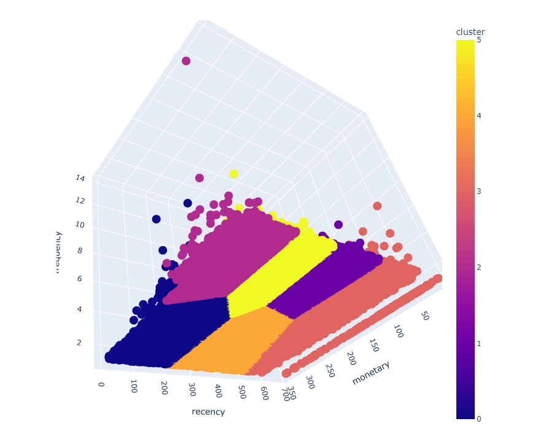
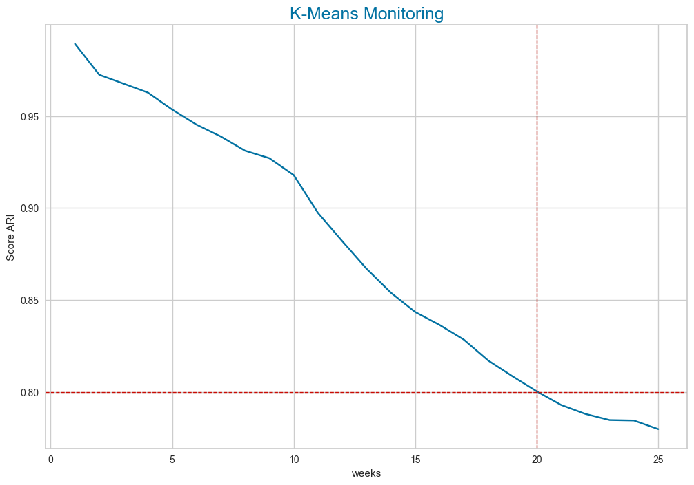

# Customer Segmentation Project

## Overview
This project aims to perform customer segmentation using machine learning techniques. Customer segmentation involves grouping customers into distinct categories based on their behaviors, preferences, and attributes. By segmenting customers, businesses can tailor their marketing strategies, product offerings, and customer service to better meet the needs of different customer segments.

## Milestones
The project is divided into several milestones, each focusing on specific tasks and objectives related to customer segmentation:

1. **Exploratory Data Analysis (EDA):** Analyzing the content of available tables, preparing data for analysis, and conducting exploratory data analysis to understand customer behavior and patterns.
2. **Creation of Individual Customer Files:** Generating individual customer files and focusing on meaningful features such as Recency, Frequency, and Monetary (RFM) values.
3. **Development of Clustering Models:** Building clustering models using algorithms like k-means and evaluating their performance using technical measures and business-oriented analysis.
4. **Maintenance Contract - Simulations:** Determining the point at which the clustering model becomes obsolete and simulating maintenance periods to monitor model performance.

## Implementation
The project is implemented using Python programming language and various libraries such as pandas, scikit-learn,, plotly and matplotlib/seaborn for data manipulation, machine learning modeling.

## Files and Directories
- **scripts/**: Contains Python scripts for data preprocessing, exploratory data analysis, modeling, and evaluation.
- **results/**: Stores the results and outputs generated during the project.
- **README.md**: The README file providing an overview of the project.

## Sample Results
Here are some sample visualizations generated during the project:

## References
- [Definition of RFM Segmentation](https://www.definitions-marketing.com/definition/segmentation-rfm/): Explanation of RFM segmentation methodology.
- [Yellowbrick Clustering Evaluation Examples](https://www.kaggle.com/kautumn06/yellowbrick-clustering-evaluation-examples): Reference for using Yellowbrick library for clustering evaluation.

## Authors
- [Adonija ZIO ](https://github.com/Adonija-ZIO)

